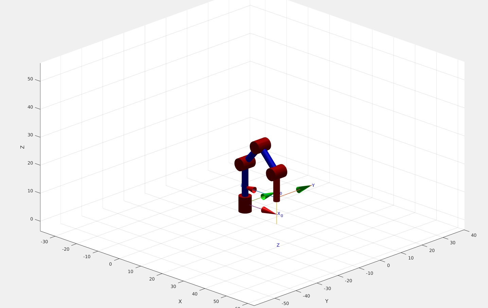

<h1 align="center"; style="text-align:center;">Laboratorio 3: Cinemática Inversa - Robot Phantom X - ROS</h1>
<p align="center";style="font-size:50px; background-color:pink; color:red; text-align:center;line-height : 60px; margin : 0; padding : 0;">
Robótica</p1>
<p align="center";style="font-size:50px; text-align:center; line-height : 40px;  margin-top : 0; margin-bottom : 0; "> <br> Giovanni Andrés Páez Ujueta</p>
<p align="center";style="font-size:50px; text-align:center; line-height : 20px; margin-top : 0; "> email: gpaezu@unal.edu.co</p>
<p align="center"; style="font-size:50px; text-align:center; line-height : 40px;  margin-top : 0; margin-bottom : 0; "> <br> Daniel Esteban Bohórquez Cifuentes</p>
<p align="center"; style="font-size:50px; text-align:center; line-height : 20px; margin-top : 0; "> email: dbohorquezc@unal.edu.co</p>
<p align="center"; style="font-size:50px; text-align:center; line-height : 40px;  margin-top : 0; margin-bottom : 0; "> <br> Nicolas Pulido Gerena</p>
<p align="center"; style="font-size:50px; text-align:center; line-height : 20px; margin-top : 0; "> email: npulido@unal.edu.co</p>
<p align="center"; style="font-size:50px; text-align:center; line-height : 30px;  margin-top : 0; margin-bottom : 0; "> <br><br>INGENIERÍA MECATRÓNICA</p>
<p align="center"; style="font-size:50px; text-align:center; line-height : 30px; margin-top : 0; "> Facultad de Ingeniería</p>
<p align="center"; style="font-size:50px; text-align:center; line-height : 30px; margin-top : 0; "> Universidad Nacional de Colombia Sede Bogotá</p>
<br>
<p align="center">
  
</p>

<p align="center"; style="font-size:50px; text-align:center; line-height : 30px; margin-top : 0; "> <br>13 de mayo de 2022</p>

## Metodología

### Cinemática Inversa

Se tiene el valor de $q_1$ como:

$$
\begin{gather*}
    q_1=\mathrm{atan2}(X_\mathrm{T},Y_\mathrm{T})
\end{gather*}
$$

donde los valores de $X_\mathrm{T}$ y $Y_\mathrm{T}$ corresponden a coordenadas del TCP.

Se realiza un desacople de la muñeca de la ultima articulación por lo que la posición de nuestro TCP se mueve la distancia correspondiente a $l_4$ en la dirección del vector "$a$"(approach en la nomenclatura NOA), por lo que la posición de la muñeca corresponde a:

$$
\begin{align*}
    W&=
    \begin{bmatrix}
        X_\mathrm{T}\\
        Y_\mathrm{T}\\
        Z_\mathrm{T}
    \end{bmatrix}
    -l_4
    \begin{bmatrix}
        a_X\\
        a_Y\\
        a_Z
    \end{bmatrix}
\end{align*}
$$

Donde los valores de $a_X$, $a_Y$ and $a_Z$ corresponden a los componentes cartesianos del vector "$a$". A partir de esto es posible determinar los componentes de la matriz de rotación de nuestro TCP. De esta forma es posible simplificar este problema de cinematica inversa al de un mecanismo 2R, donde se proponen dos soluciones: Codo arriba y Codo abajo:


$$
\begin{gather*}
    r = \sqrt{X_W^2+Y_W^2} \ \ \ \ \ \ h = z_w-l_1\\
    c = \sqrt{r^2+h^2}\\
    \\
    \beta = \mathrm{arctan2}(l_m,l_2) \ \ \ \ \ \ \psi = \frac{\pi}{2}-\beta\\
    l_r = \sqrt{l_m^2+l_2^2}\\
    \\
    \phi = \mathrm{arccos}(\frac{c^2-l_3^2-l_r^2}{-2l_rl_3}) \ \ \ \ \ \ \alpha =  \arccos{\frac{l_3^2-l_r^2-c^2}{-2l_rc}}
    \\
    \gamma = \arctan2{(h,r)}
\end{gather*}
$$

Se utilizan las siguientes ecuaciones para definir las soluciones de Codo arriba y Codo abajo:

#### CODO ARRIBA:

$$
\begin{gather*} 
  q_2 = \frac{\pi}{2}-\beta-\alpha-\gamma \\
  q_3 = \pi-\psi-\phi
\end{gather*}
$$

#### CODO ABAJO:

$$
\begin{gather*} 
  q_2 = \frac{\pi}{2}-(\gamma-\alpha+\beta)\\
  q_3 = -\pi+(\phi-\psi)
\end{gather*}
$$

Una vez definidos los ángulos se vuelve a acoplar la muñeca y se define su angulo como:

$$
\begin{gather*}
    \theta_a=\mathrm{\arctan2}\left(\sqrt{X_a^2+Y_a^2},Z_a\right)\\
    q_4=\theta_a-q_2-q_3-\frac{\pi}{2}
\end{gather*}
$$

Donde $\theta_a$ corresponde al angulo del vector "$a$" respecto al eje $Z_0$.

### ROS - Aplicación de Pick and place
Para esta parte del laboratorio se hizo uso de la conexión de Matlab con ROS y su capacidad de permitir acceder y llamar los servicios que presente con respecto a una aplicación determinada por medio de código dentro del software. Es necesario mencionar que se tiene que relaizar un proceso previo el cual antecede al trabajo dentro Matlab, tal y como se menciono en los anteriores laboratorios se dan permisos de administrador al puerto donde se inserta la FTDI, se inicia el nodo maestro y se utiliza el launch que permite mover los motores. Se sigue el mismo proceso expresado en el Lab 1 donde se crea un nodo de MAtlab con el nodo maestro, y un cliente que permita ingresar a los servicios del Dynamixel Command por medio de un mensaje que indicará el movimiento de los motores a partir del siguiente código:

```
%%
clc
clear
rosshutdown
rosinit;
%%
motorSvcClient = rossvcclient('/dynamixel_workbench/dynamixel_command');
motorCommandMsg= rosmessage(motorSvcClient);
```
Como primer análisis es necesario encontrar una forma en el que se realice un tipo de interpolación entre dos puntos que se conozca la rotación y traslación del efector final tal y como lo pide la cinemática inversa. Para esto se investigó una función del Toolbox de Peter Corke que permita realizar este proceso y tener una trayectoria más fluida y no solo dos puntos en el espacio, "ctraj" es la encargada de realizar este proceso, tiene como parámetros el ingreso de una matriz de transformación homogenea inicial, una de objetivo y por ultimo el numero de puntos que se quieren en la trayectoria, entre mas se tengan se consume más tiempo de procesamiento. Ahora el siguiente problema es la obtención de dichas matrices, para esto se hizo uso del modelo utilizado en el Lab2 donde se puede ver de manera gráfica e interactiva la posicion dl robot y el marco de referencia del eslabón con respecto a la base.
<p align="center">
  
</p>
Para la obtención de la información del tipo de rotación  que presenta el marco de referencia de la herramienta con respecto a la base, se analiza la magnitud que debe tener dicha rotación de manera empírica y observación de los diferentes marcos, en algunos casos solo se realiza una modificación de la traslación, de esta manera se generan las suguientes matrices de transformacion homogenea.
```
%Matriz de Home
MTHinit=[1 0 0 0;0 1 0 0;0 0 1 44.9;0 0 0 1];
%Matriz intermedia entre el punto encima del poste y el Home
MTHinter1a=[0.7071 0 0.7071 14.483;0 1 0 0;-0.7071 0 0.7071 40.466;0 0 0 1];
%Matriz que representa la poscición a 10 cm encima del poste
MTHinter=[-1 0 0 15;0 1 0 0;0 0 -1 10;0 0 0 1];
%MTH de 8 cm encima del poste
MTHinter2=[-1 0 0 15;0 1 0 0;0 0 -1 8;0 0 0 1];
%MTH de la rotación a la izquierda del efector y posicion de 10 cm encima del primer cilindro
MTHrotz1=trotz(pi/2)*MTHinter;MTHrotz1(1,4)=0;MTHrotz1(2,4)=15;
%MTH del acercamiento al primer cilindro
MTHFinal1=MTHrotz1;MTHFinal1(3,4)=4;
%MTH de la rotación a la derecha del efector y posición de 10 cm encima del segunda cilindro
MTHrotz2=trotz(-pi/2)*MTHinter;MTHrotz2(1,4)=0;MTHrotz2(2,4)=-15;
%MTH del acercamiento al segunda cilindro
MTHFinal2=MTHrotz2;MTHFinal2(3,4)=4;
```
### Videos
## Conclusiones 

* Como se muestra en el video la precisión del robot se puede ver afectada por la vida util de los componentes o por el mal uso como los golpes los cuales pueden afectar la integridad fisica del dispositivo llevando así a perturbaciones en la trayectoria evidenciadas principalmente en las oscilaciones. 
* El funcionamiento en conjunto de la función "ctraj" y la cinemática inversa en algunos casos presentaba soluciones que no era adecuadas o posibles para los motores, por ende fue necesario ingresar puntos intermedios manuales que indicaran un inicio de por donde se desea que siga la trayectoria, tal y como lo representa la MTH "MTHinter1a".
